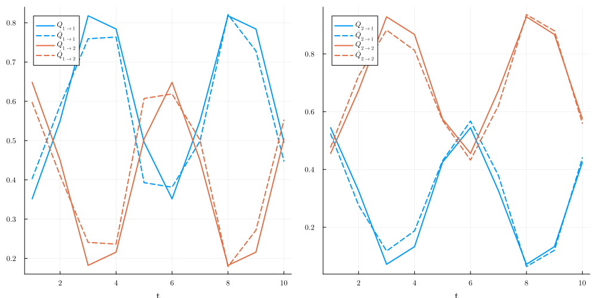

# PeriodicHiddenMarkovModels

This package is an extension of the package [HMMBase.jl](https://github.com/maxmouchet/HMMBase.jl) that originally define, use, fit Hidden Markov Models.
The extension adds the subtype `PeriodicHMM` to the type `HMMBase.AbstractHMM` that deals with non-constant transition matrix `A(t)` and emission distribution `B(t)`.

WARNING: As it is `fit_mle` does not enforce smoothness of hidden states with `t` i.e. because HMM are identifiable up to a relabeling nothing prevents that after fitting `ν[k=1, t=1]` and `ν[k=1, t=2]` mean the same hidden state (same for `Q` matrix).
To enforce smoothness and identifiability (up to a global index relabeling), one can be inspired by seasonal Hidden Markov Model, see [A. Touron (2019)](https://link.springer.com/article/10.1007/s11222-019-09854-4).
I implement that idea and generalization to other statistic model like HMM, Mixture, Auto Regressive in [SmoothPeriodicStatsModels.jl](https://github.com/dmetivie/SmoothPeriodicStatsModels.jl).

## Simple example

```julia
using PeriodicHiddenMarkovModels
using Distributions
```

### Creating matrix

```julia
K = 2 # Number of hidden states
T = 10 # Period of the HMM
N = 50_000 # Number of observation

# Hand made transition matrix
Q = zeros(K, K, T)
Q[1, 1, :] = [0.25 + 0.1 + 0.5cos(2π / T * t + 1)^2 for t in 1:T]
Q[1, 2, :] = [0.25 - 0.1 + 0.5sin(2π / T * t + 1)^2 for t in 1:T]
Q[2, 2, :] = [0.25 + 0.2 + 0.5cos(2π / T * (t - T / 3))^2 for t in 1:T]
Q[2, 1, :] = [0.25 - 0.2 + 0.5sin(2π / T * (t - T / 3))^2 for t in 1:T]

# Hand made emission distribution
dist = [Normal for i in 1:K]
ν = [dist[i](2i * cos(2π * t / T), i + cos(2π / T * (t - i / 2 + 1))^2) for i in 1:K, t in 1:T]

# Define the HMM
hmm = PeriodicHMM(Q, ν)
```

### Creating guess matrix (initial condition for the EM algorithm)

Here we add noise to the true matrix.

```julia
ν_guess = [dist[i](2i * cos(2π * t / T) + 0.01 * randn(), i + cos(2π / T * (t - i / 2 + 1))^2 + 0.05 * randn()) for i in 1:K, t in 1:T]
Q_guess = copy(Q)

ξ = rand(Uniform(0, 0.15))
Q_guess[1, 1, :] .+= ξ
Q_guess[1, 2, :] .-= ξ

ξ = rand(Uniform(0, 0.05))
Q_guess[1, 1, :] .+= ξ
Q_guess[1, 2, :] .-= ξ
hmm_guess0 = PeriodicHMM(Q, ν)
```

### Sampling from the HMM

```julia
y = rand(hmm, N)
```

### Fitting the HMM

```julia
hmm_fit, hist = fit_mle(hmm_guess0, y, display=:none, robust=true, maxiter=1000)
```

### Plotting the results

```julia
using Plots, LaTeXStrings
default(fontfamily="Computer Modern", linewidth=2, label=nothing, grid=true, framestyle=:default)
```

#### Transition matrix

```julia
p = [plot(xlabel=L"t") for i in 1:K]
for i in 1:K, j in 1:K
    plot!(p[i], 1:T, Q[i, j, :], label=L"Q_{%$(i)\to %$(j)}", c = j)
    plot!(p[i], 1:T, hmm_fit.A[i, j, :], label=L"\hat{Q}_{%$(i)\to %$(j)}", c=j, s=:dash)
end
plot(p..., size=(1000, 500))
```


#### Emission distribution

```julia
p = [plot(xlabel=L"t", title = L"K = %$(i)") for i in 1:K]
for i in 1:K
    plot!(p[i], 1:T, mean.(ν[i, :]), label="mean", c = 1)
    plot!(p[i], 1:T, mean.(hmm_fit.B[i, :]), label="Estimated mean", c=1, s=:dash)
    plot!(p[i], 1:T, std.(ν[i, :]), label="std", c=2)
    plot!(p[i], 1:T, std.(hmm_fit.B[i, :]), label="Estimated std", c=2, s=:dash)
end
plot(p..., size=(1000, 500))
```

